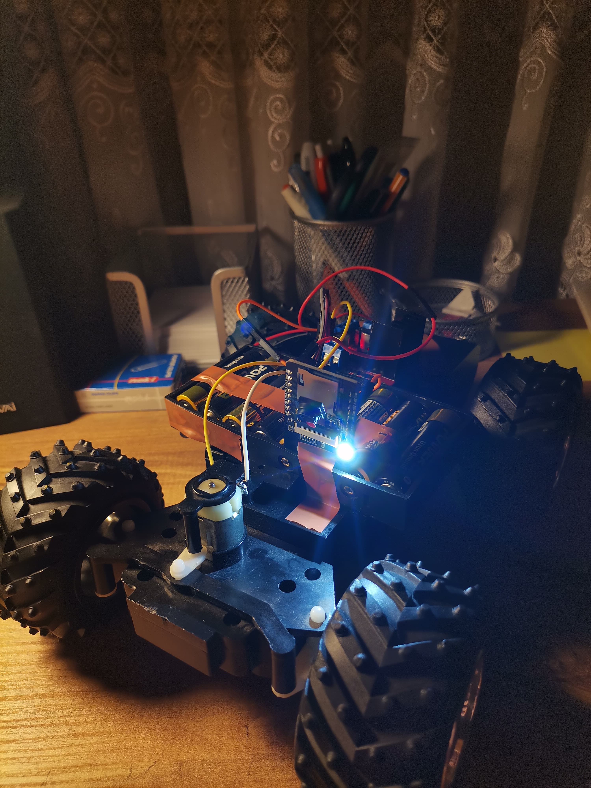
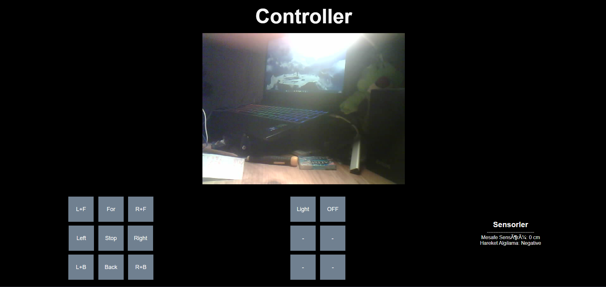

<h1 align="center">WebServer_ESP32CAM_Vehicle</h1>

Ongoing vehicle project. You can currently perform vehicle control via the web server.

<h3 align="center">Car</h3>

<h3 align="center">Controller</h3>

